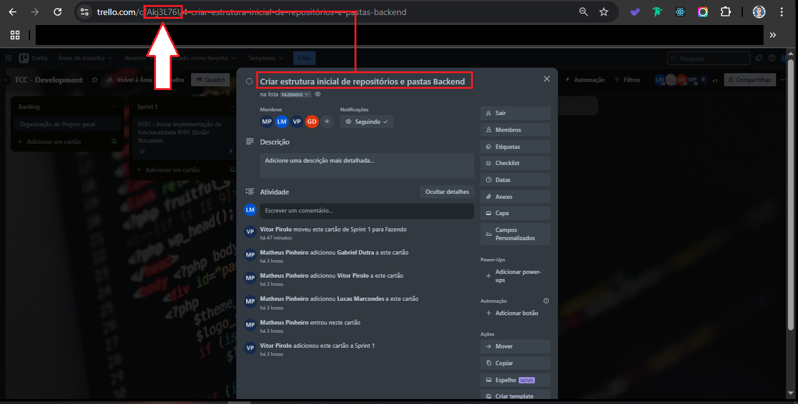

# O que é o &lt;código-task&gt;?

O `<código-task>` é o código da tarefa que está lá no [Trello](https://trello.com/b/JO46SY0W/tcc-development).



Então, quando for criar a sua branch, verifique o código da sua tarefa lá no Trello.
Exemplo:

- Branch para a estrutura inicial do projeto

```bash
git branch feat/Akj3L76I-initial-project-structure
```